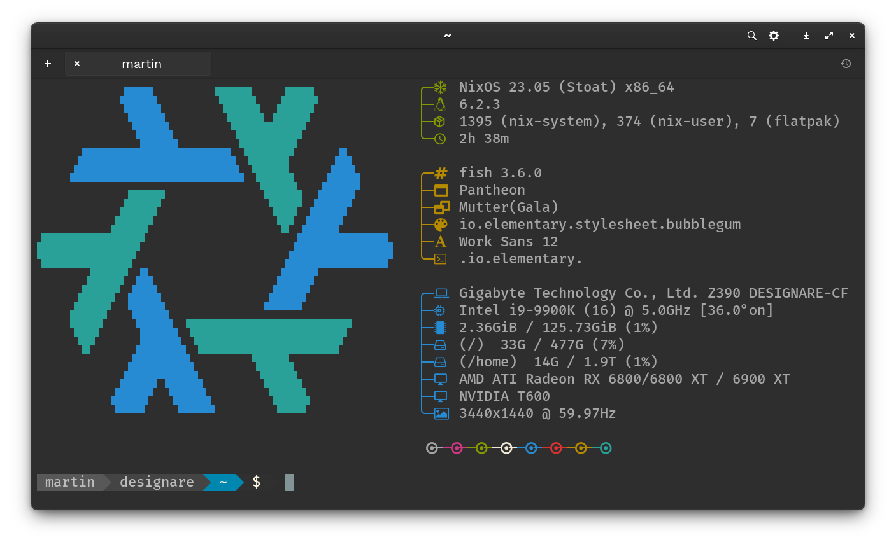
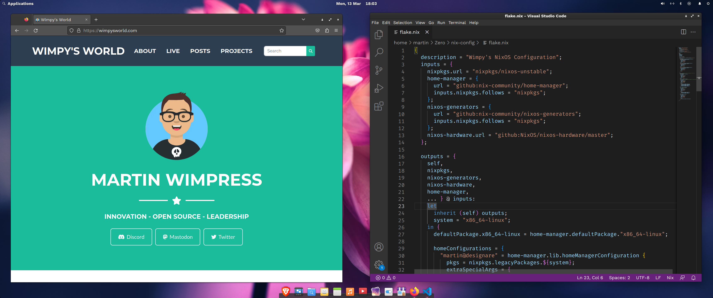

# Wimpy's [NixOS]  & [Home Manager] Configurations

[NixOS]: https://nixos.org/
[Home Manager]: https://github.com/nix-community/home-manager

This repository contains a [Nix Flake](https://nixos.wiki/wiki/Flakes) for configuring my computers and home environment. These are the computers this configuration currently manages:

|  Hostname   |        Model        |  Role   |  Status  |
| :---------: | :-----------------: | :-----: | :------- |
| `designare` | DIY i9-9900K        | Desktop | Done     |
| `z13`       | Lenono ThinkPad Z13 | Laptop  | WIP      |
| `skull`     | Intel NUC6i7KYK     | Server  | WIP      |

## Structure

- [home]: Home Manager configurations
  - Sane defaults for shell and desktop
- [host]: NixOS configurations
  - Includes discrete hardware configurations which leverage the [NixOS Hardware modules](https://github.com/NixOS/nixos-hardware) via [flake.nix].
- [scripts]: Helper scripts

The [host/_mixins] and [home/_mixins] are a collection of generic configurations that are composited based on the arguments defined in [flake.nix].

[home]: ./home
[host]: ./host
[host/_mixins]: ./host/_mixins
[home/_mixins]: ./home/_mixins
[flake.nix]: ./flake.nix
[scripts]: ./scripts

## Applying Changes

I clone this repo to `~/Zero/nix-config`. Home Manager and NixOS changes can be applied separately because I am planning to add support for some non-NixOS hosts.

```bash
gh repo clone wimpysworld/nix-config ~/Zero/nix-config
```

### NixOS ❄️

A `rebuild-host` alias is provided, that does the following:

```bash
sudo nixos-rebuild switch --flake $HOME/Zero/nix-config
```

### Home Manager 🏠️

A `rebuild-home` alias is provided, that does the following:

```bash
home-manager switch -b backup --flake $HOME/Zero/nix-config
```

## What's in the box? 🎁

Nix is configured with [flake support](https://zero-to-nix.com/concepts/flakes) and the [unified CLI](https://zero-to-nix.com/concepts/nix#unified-cli) enabled.

### Structure

This is the directory structure I'm using.

```
.
├── home
│   ├── _mixins
│   │   ├── console
│   │   └── desktop
│   └── default.nix
├── host
│   ├── _mixins
│   │   ├── base
│   │   ├── boxes
│   │   ├── desktop
│   │   ├── services
│   │   └── users
│   ├── designare
│   ├── generic
│   ├── skull
│   ├── z13
│   └── default.nix
├── scripts
└── flake.nix
```

### The Shell 🐚

[Fish shell] with [powerline-go](https://github.com/justjanne/powerline-go) and a collection of tools that deliver a somewhat *"[Modern Unix]"* experience. The base system has a firewall enabled and also includes [OpenSSH], [Tailscale], [Docker & Distrobox] and, of course, a delightfully configured [nano]. (*Fight me!* 🥊)

[Fish shell]: ./home/_mixins/console/fish.nix
[Modern Unix]: ./home/_mixins/console/default.nix
[OpenSSH]: ./host/_mixins/services/openssh.nix
[Tailscale]: ./host/_mixins/services/tailscale.nix
[Docker & Distrobox]: ./host/_mixins/boxes/docker.nix
[nano]: ./host/_mixins/base/nano.nix



### The Desktop 🖥️

MATE Desktop 🧉 and Pantheon 🏛️ are the two desktop options available. The [font configuration] is common with both desktops using [Work Sans](https://fonts.google.com/specimen/Work+Sans) and [Fira Code](https://fonts.google.com/specimen/Fira+Code). The usual creature comforts you'd expect to find in a Linux Desktop are integrated such as [Pipewire], Bluetooth, [Avahi], [CUPS], [SANE] and [NetworkManager].

[font configuration]: ./host/_mixins/desktop/default.nix
[Pipewire]: ./host/_mixins/services/pipewire.nix
[Avahi]: ./host/_mixins/services/avahi.nix
[CUPS]: ./host/_mixins/services/cups.nix
[SANE]: ./host/_mixins/services/sane.nix
[NetworkManager]: ./host/_mixins/services/networkmanager.nix

|  Desktop  |       System       |       Configuration       |             Theme            |
| :-------: | :----------------: | :-----------------------: | :--------------------------: |
| MATE      | [MATE Install]     | [MATE Configuration]      | Yaru Magenta (Dark)          |
| Pantheon  | [Pantheon Install] | [Pantheon Configuration]  | elementary Bubble Gum (Dark) |

[MATE Install]: ./host/_mixins/desktop/mate.nix
[Pantheon Install]: ./host/_mixins/desktop/pantheon.nix
[MATE Configuration]: ./home/_mixins/desktop/mate.nix
[Pantheon Configuration]: ./home/_mixins/desktop/pantheon.nix

## Eye Candy 👀🍬



## TODO 🗒️

- [ ] Implement [Disko](https://github.com/nix-community/disko) partitioning (*WIP*)
  - Chasing the ideas outlined in these blog posts:
  - [Setting up my new laptop: nix style](https://bmcgee.ie/posts/2022/12/setting-up-my-new-laptop-nix-style/)
  - [Setting up my machines: nix style](https://aldoborrero.com/posts/2023/01/15/setting-up-my-machines-nix-style/)
- [x] Integrate Keybase
- [x] Integrate an Emoji picker
- [x] Integrate AppCenter and Flathub
- [ ] Integrate Steam
- [x] Integrate OpenRGB
- [x] Integrate OpenRazer
- [ ] Integrate Syncthing
- [x] Integrate fwupd
- [ ] Integrate dotfiles
- [ ] Integrate .iso and VM builds via [nixos-generators](https://github.com/nix-community/nixos-generators)
- [ ] Include image assets such as wallpapers and faces
- [ ] Include Serif fonts and fallbacks for Work Sans and Fira Code.
- [ ] Move user-specific settings to Home Manager
- [ ] Move application defaults out of the desktop defaults
- [ ] Add all computers to the table
- [ ] Fix [Unfree in Home Manager](https://nixos.wiki/wiki/Flakes#Enable_unfree_software)
- [x] Fix Magewell driver: [nixpkgs#221209](https://github.com/NixOS/nixpkgs/pull/221209)
- [ ] Migrate (*maybe*) to ZFS and [`zrepl`](https://zrepl.github.io/) for backups

## Inspirations

Before preparing my NixOS and Home Manager configurations I took a look at what other Nix users are doing. My colleagues shared their configs and tips which included [nome from Luc Perkins], [nixos-config from Cole Helbling], [flake from Ana Hoverbear] and her [Declarative GNOME configuration with NixOS] blog post. A couple of friends also shared their configurations and here's [Jon Seager's nixos-config] and [Aaron Honeycutt's nix-configs]. While learning Nix I watched some talks/interviews with [Matthew Croughan](https://github.com/MatthewCroughan) and [Will Taylor's Nix tutorials on Youtube](https://www.youtube.com/playlist?list=PL-saUBvIJzOkjAw_vOac75v-x6EzNzZq-). [Will Taylor's dotfiles] are worth a look, as are his videos, and [Matthew Croughan's nixcfg] is also a useful reference.

I really like the directory hierarchy in [Jon Seager's nixos-config] and the mixin pattern used in [Matthew Croughan's nixcfg], so my initial Nix configuration is heavily influenced by both of those. Ana's excellent [Declarative GNOME configuration with NixOS] blog post was essential to get a personalised desktop . That said, there's plenty to learn from browsing other peoples Nix configurations, not least for discovering cool software. I recommend a search of [GitHub nixos configuration] from time to time to see what interesting techniques you pickup and new tools you might discover.

[nome from Luc Perkins]: https://github.com/the-nix-way/nome
[nixos-config from Cole Helbling]: https://github.com/cole-h/nixos-config
[flake from Ana Hoverbear]: https://github.com/Hoverbear-Consulting/flake
[Declarative GNOME configuration with NixOS]: https://hoverbear.org/blog/declarative-gnome-configuration-in-nixos/
[Jon Seager's nixos-config]: https://github.com/jnsgruk/nixos-config
[Aaron Honeycutt's nix-configs]: https://gitlab.com/ahoneybun/nix-configs
[Matthew Croughan's nixcfg]: https://github.com/MatthewCroughan/nixcfg
[Will Taylor's dotfiles]: https://github.com/wiltaylor/dotfiles
[GitHub nixos configuration]: https://github.com/search?q=nixos+configuration
